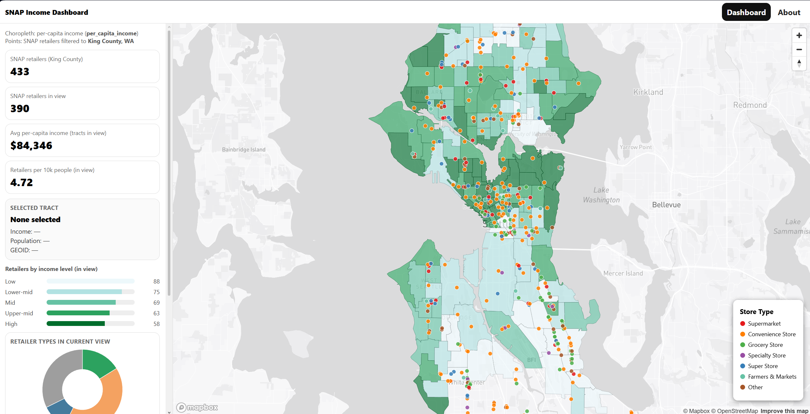
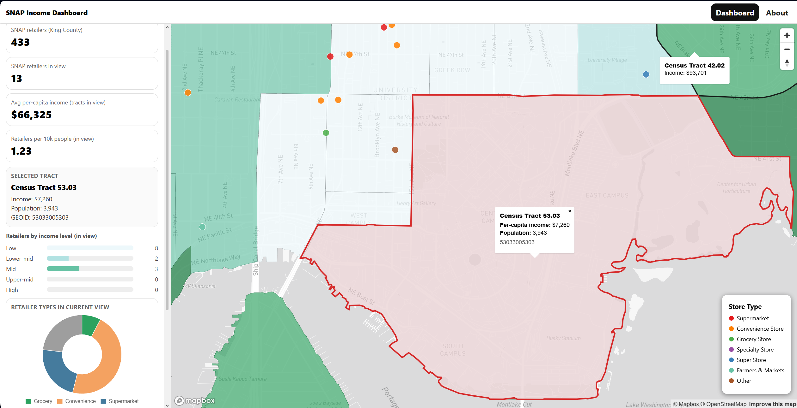

# Visualizing Seattle SNAP Retailers
https://anna-beck.github.io/SeattleSNAPdashboard/

### Team members

- Evelyn Kate Antonyuk
- Anya Beck
- Nuria Abas Ibrahim
- Mimi Richert
- Hieu Tran

### Project description

The purpose of this project is to develop an interactive dashboard that explores the relationship between SNAP-authorized retailer locations and neighborhood income levels across Seattle. Because income levels vary widely between neighborhoods, residents may experience different levels of access to food retailers that accept SNAP benefits. This dashboard combines SNAP retailer data with census tract income information to help users examine how food access is distributed across the city. The visualization includes an income choropleth map showing per-capita income by census tract and a dot density layer where each point represents an individual SNAP retailer.

### Project Illustration.

Overview of Snap distribution across the Seattle Area with interactive points displaying SNAP retailers over different census tracts across the city.

Focusing on a certain neighborhood to compare SNAP location coverage within Seattle.

### Project Goals: 

Seattle has neighborhoods with very different income levels and people's ability to reach a snap authorized retailer can vary depending on where they live. The purpose of this dashboard is to visualize how the distribution of snap authorized retailers affects the accessibility within the neighborhoods in Seattle. The dashboard helps people see where access is strong, thin, or where it is mismatched with their community’s needs.

### Data Sets:

SNAP Retailer CSV - https://usda-snap-retailers-usda-fns.hub.arcgis.com/datasets/8b260f9a10b0459aa441ad8588c2251c_0/about

ACS Income Data for Seattle - https://data-seattlecitygis.opendata.arcgis.com/datasets/SeattleCityGIS::per-capita-income-and-aggregate-income-in-the-past-12-months-in-inflation-adjusted-dollars/explore

TIGER/Line Shapefile, All Roads, King County - https://catalog.data.gov/dataset/tiger-line-shapefile-2021-county-king-county-wa-all-roads

### Libraries Used: 

- Mapbox GL JS for interactive geospatial visualization
- Chart.js for dynamic chart
- Language: HTML, CSS, JS
- Web Service: github, mapbox

#### AI Disclosure: No AI tools were used in this assignment.
